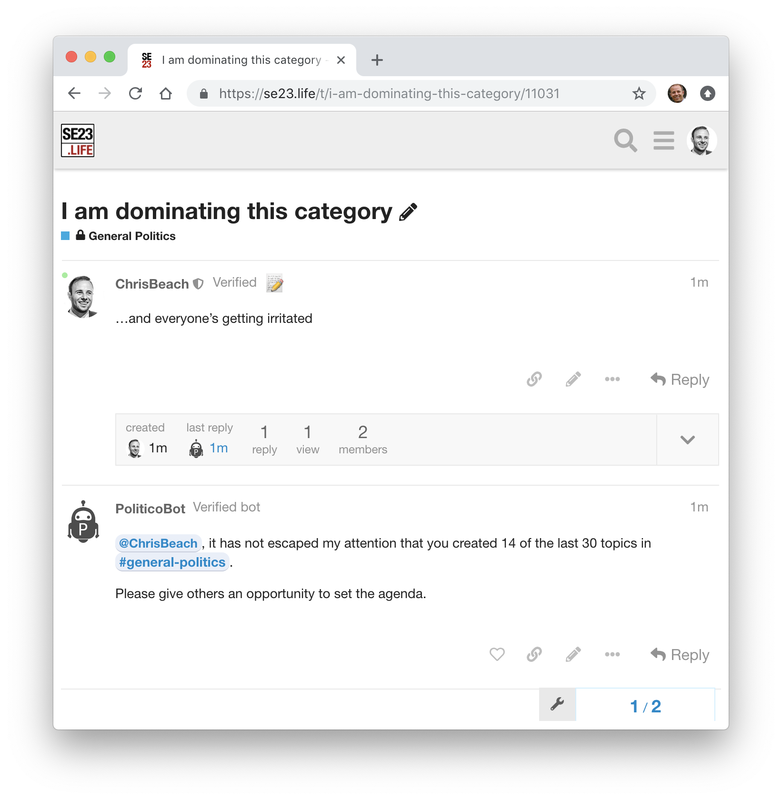

## Anti-Domination Bot

[Related discussion on meta.discourse.org](https://meta.discourse.org/t/anti-domination-bot/103802)

Polls a given category within a Discourse forum and posts a warning message if the author of the most recent topic has 
authored a significant proportion of the last 30 topics.
 
 

### Configuration

Customise [src/main/resources/application.conf.sample](src/main/resources/application.conf.sample) and save as
`src/main/resources/application.conf` 

See comments in file for instructions

### Running with Docker

    docker run -t \
        -v /path/to/your/application.conf:/root/src/main/resources/application.conf \
        chrisbeach/anti-domination-bot

NOTE: `/path/to/your/application.conf` is the location of your customised application.conf file and must be specified as an 
absolute path.

### Running (Development)

NOTE: Requires [SBT](https://www.scala-sbt.org/)

    sbt run